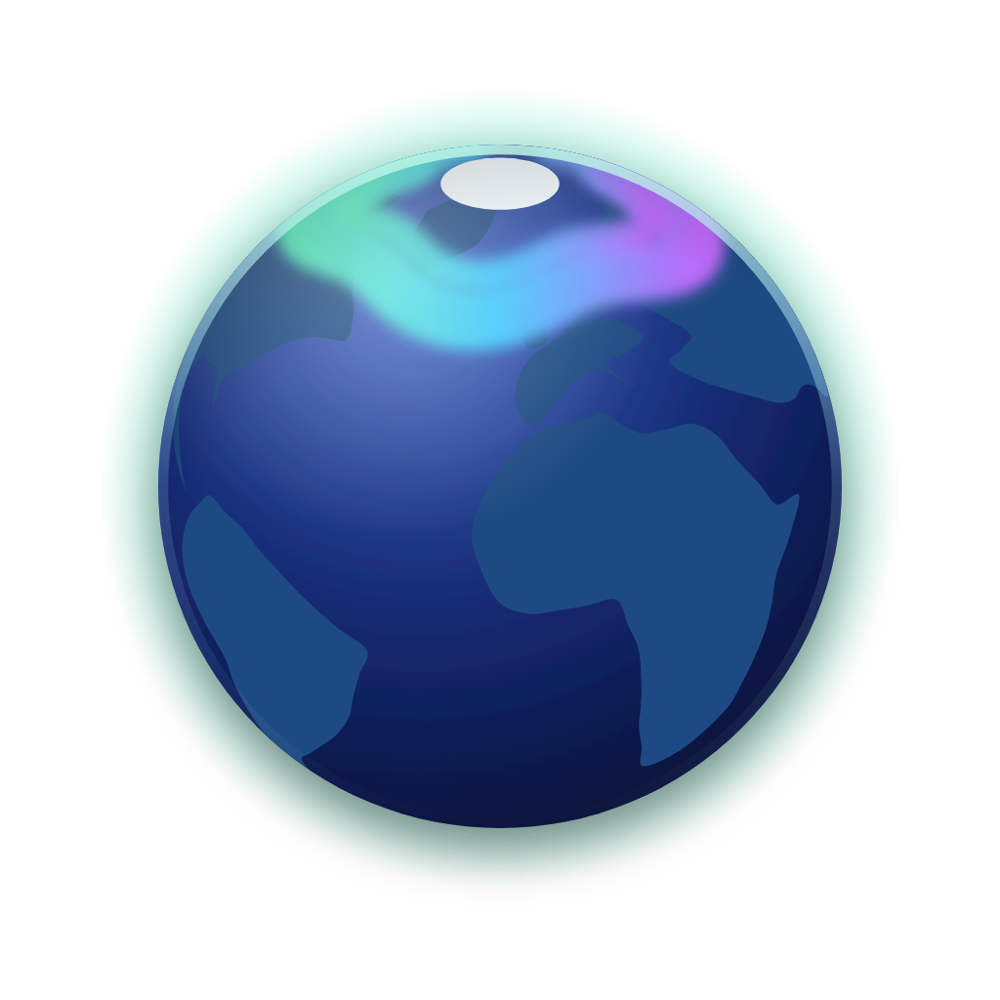
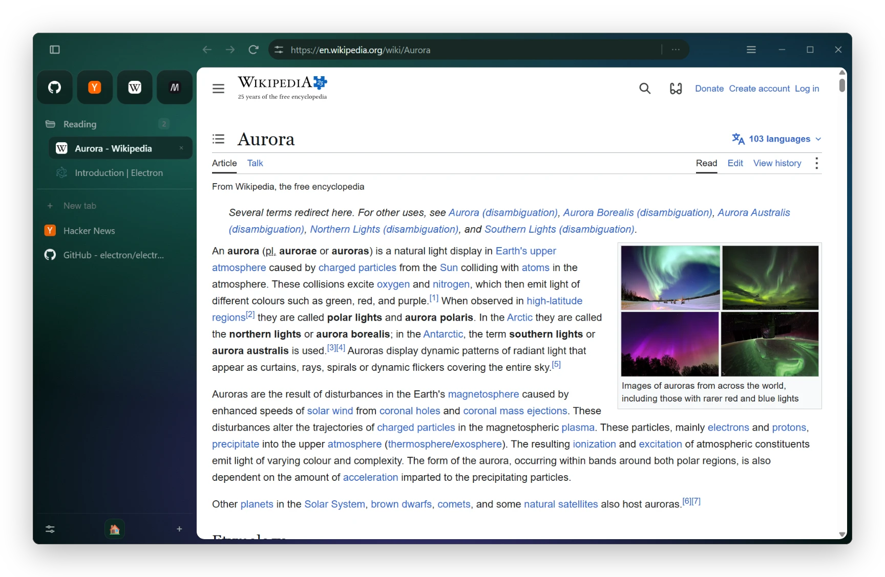
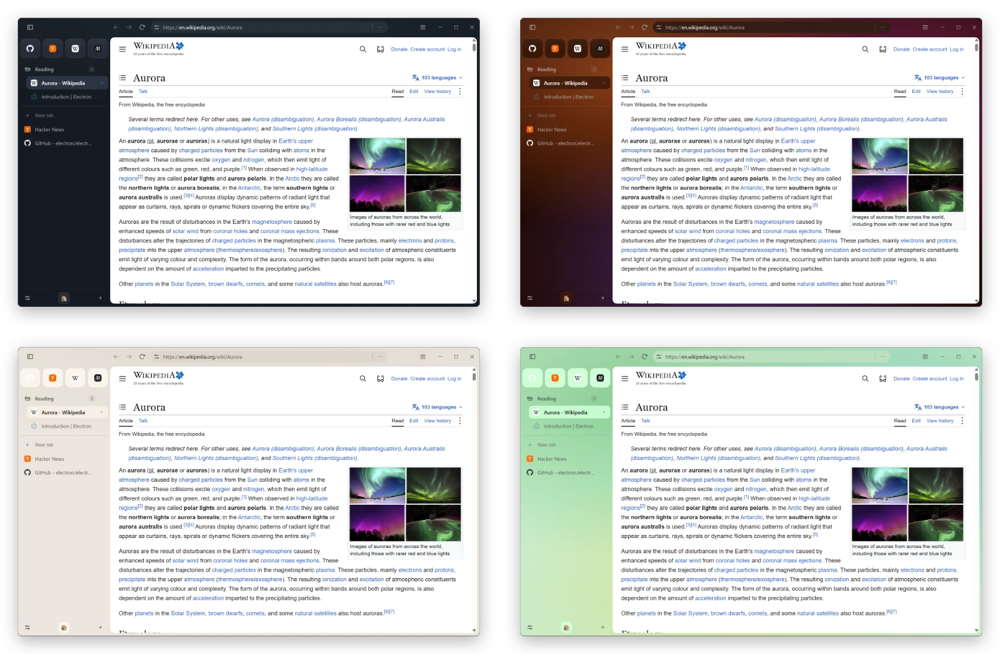
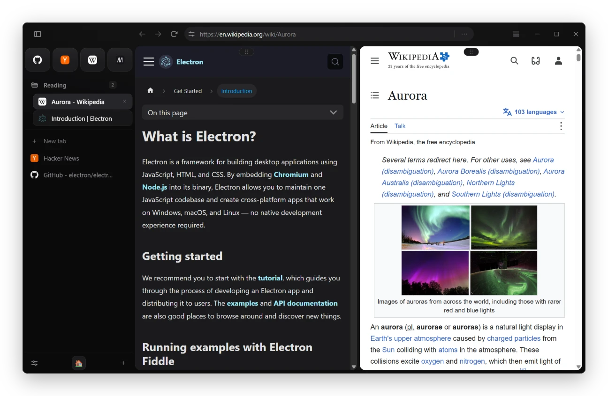
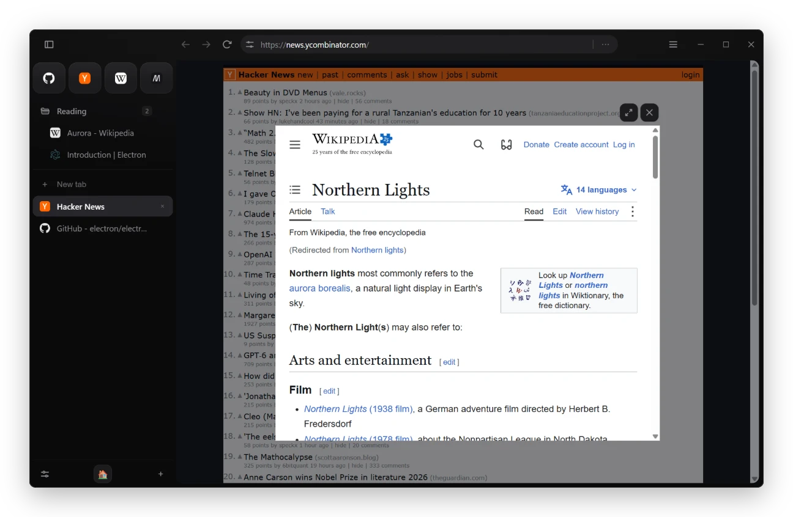
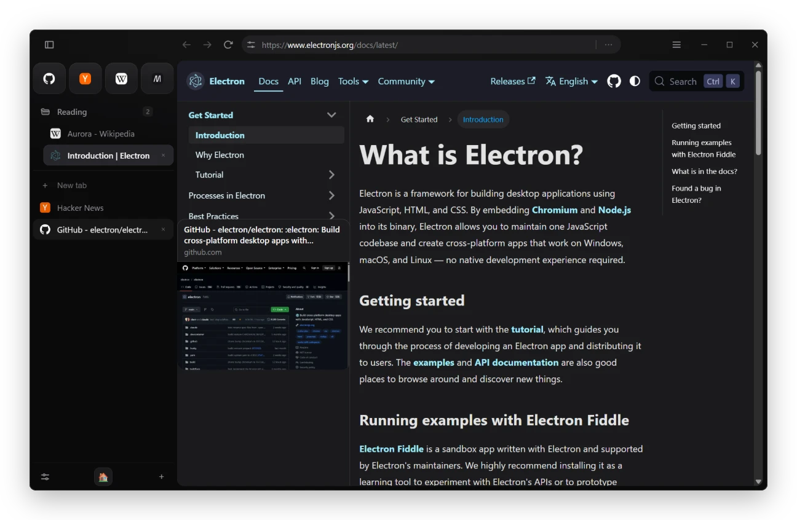
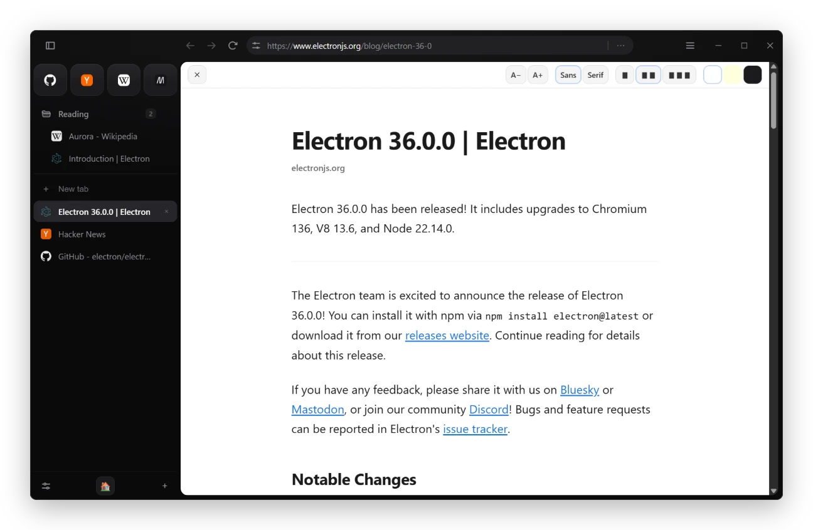
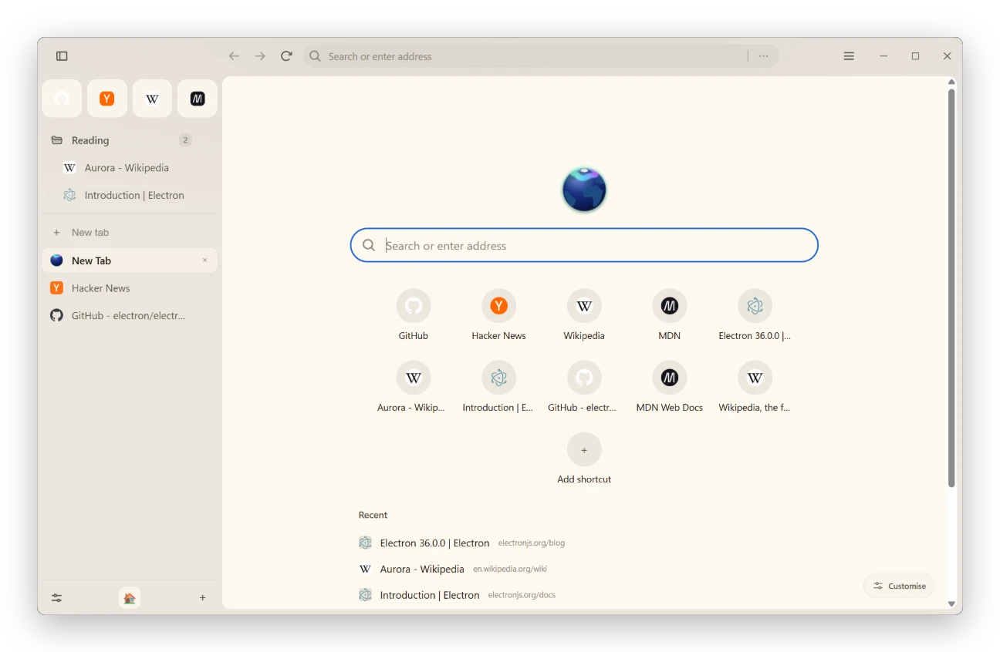

<div align="center">



# Northstar

**A quiet browser for people with too many tabs.**

Spaces instead of a wall of tabs. A sidebar instead of a strip.<br>
A theme you build yourself, and a browser that stays out of the way.


[Tour](#a-quick-tour) · [Features](#everything-else) · [Shortcuts](#keyboard) · [Run it](#run-it) · [Hack on it](#under-the-hood)

<br>



</div>

<br>

## Why another browser?

Because thirty tabs in a row is not a workspace. Northstar is built around three ideas:

- **Spaces, not a tab wall.** Work, Home, that side project: each Space keeps its own tabs, bookmarks, history and logins. Switch with a click or <kbd>Ctrl</kbd>+<kbd>Alt</kbd>+<kbd>1</kbd>–<kbd>9</kbd>.
- **Your colours, everywhere.** Pick a ground and an accent, and Northstar derives every surface from them. Contrast stays readable however far you push it. Each Space can wear its own.
- **Quiet by default.** Ads and trackers are blocked out of the box. Focus mode hides the feed, reader view strips the page, and nothing pops up unless you asked for it.

## A quick tour

### Make it yours

Eleven built-in themes, from the soft gradients of Aurora and Sunset to calm Clay and Fog. Or drag dots on a colour field to make your own. Every theme is generated from a few choices, so the whole browser always looks like one thing.



### Two pages, one window

Drag a tab onto the page, or press <kbd>Ctrl</kbd>+<kbd>Shift</kbd>+<kbd>E</kbd>, to read the docs while you write the code.



### Look before you leap

<table>
<tr>
<td width="50%" valign="top">

<p><b>Glance.</b> <kbd>Alt</kbd>-click a link and it opens in a floating preview over the page you're on. Press <kbd>Ctrl</kbd>+<kbd>Enter</kbd> to keep it as a tab, or <kbd>Esc</kbd> to carry on.</p>
</td>
<td width="50%" valign="top">

<p><b>Tab previews.</b> Hover a tab to see its title, its site and a snapshot of the page, so you can find the right one without switching.</p>
</td>
</tr>
<tr>
<td width="50%" valign="top">

<p><b>Reader view.</b> One shortcut (<kbd>Ctrl</kbd>+<kbd>Alt</kbd>+<kbd>R</kbd>) turns a cluttered article into clean text, with your choice of size, typeface, width and paper.</p>
</td>
<td width="50%" valign="top">

<p><b>A calm new tab.</b> A search field, the sites you return to and what you were just reading. Switch it to minimal and only the field is left.</p>
</td>
</tr>
</table>

## Everything else

**Stay focused.** Focus mode hides recommendations and short-form video, turns pages grayscale and runs a Pomodoro timer. Essentials keep your regular sites one click away. Group tabs into folders in the sidebar, or switch to a classic top strip (<kbd>Ctrl</kbd>+<kbd>Shift</kbd>+<kbd>S</kbd>). Search every open tab with <kbd>Ctrl</kbd>+<kbd>Shift</kbd>+<kbd>A</kbd>. Idle tabs go to sleep to save memory.

**Stay private.** Ad and tracker blocking is built in, along with HTTPS upgrades, tracking-parameter stripping and blocked third-party cookies. Private windows keep nothing. Isolated instances let you stay signed in to one site twice, side by side.

**The rest of a real browser.** Extensions from the web store, or your own unpacked ones. Passwords encrypted with your OS keychain. Import bookmarks and history from Chromium-family browsers, Firefox and Safari. Downloads, find in page, spell check and per-site zoom. A mini player for media in background tabs, and Widevine DRM playback.

## Keyboard

| Keys | Does |
|---|---|
| <kbd>Ctrl</kbd>+<kbd>T</kbd> / <kbd>Ctrl</kbd>+<kbd>W</kbd> | New tab / close tab |
| <kbd>Ctrl</kbd>+<kbd>Shift</kbd>+<kbd>T</kbd> | Reopen what you just closed |
| <kbd>Ctrl</kbd>+<kbd>L</kbd> or <kbd>Ctrl</kbd>+<kbd>K</kbd> | Address bar |
| <kbd>Ctrl</kbd>+<kbd>Shift</kbd>+<kbd>A</kbd> | Search your open tabs |
| <kbd>Ctrl</kbd>+<kbd>Alt</kbd>+<kbd>1</kbd>–<kbd>9</kbd> | Jump to a Space |
| <kbd>Ctrl</kbd>+<kbd>Shift</kbd>+<kbd>E</kbd> | Split view |
| <kbd>Ctrl</kbd>+<kbd>Alt</kbd>+<kbd>R</kbd> | Reader view |
| <kbd>Ctrl</kbd>+<kbd>Shift</kbd>+<kbd>F</kbd> | Focus mode |
| <kbd>Ctrl</kbd>+<kbd>\\</kbd> | Hide the sidebar |
| <kbd>Ctrl</kbd>+<kbd>Shift</kbd>+<kbd>S</kbd> | Sidebar ⇄ top strip |

On macOS, <kbd>Ctrl</kbd> is <kbd>⌘</kbd>.

## Run it

```bash
git clone https://github.com/Milad-exe/The-Northstar-Browser.git
cd The-Northstar-Browser
npm install
npm start
```

`npm run dev` watches the tree: CSS hot-swaps everywhere, panels and internal pages reload in place, and main-process changes restart the app.

### Build an installer

```bash
npm run dist          # every platform this machine can build
npm run dist:mac      # or dist:win / dist:linux
```

Builds are Widevine-signed through castlabs so DRM video plays. Set `SKIP_VMP=1` for an unsigned local build.

### Tests

```bash
npm run test:unit         # pure logic, no Electron, well under a second
npm run smoke             # boots the app and checks it came up clean
npm run test:e2e          # Playwright against the real UI (--quick skips the site battery)
```

## Under the hood

The repo root *is* the app: plain CommonJS, no bundler, no build step. Electron runs the files in place.

| Path | What lives there |
|---|---|
| `main.js` | entry point |
| `features/` | main-process logic: tabs, windows, themes, extensions, privacy |
| `ipc/` | `ipcMain` handlers, one file per area, loaded automatically |
| `preload/` | the `window.*` bridges each surface gets |
| `renderer/` | the UI: `Browser/` is the chrome; the rest are pages and panels |
| `locales/` | interface strings |

Every tab is its own `WebContentsView`, and so is anything drawn over a page (menus, panels, prompts), because a native page view can't be painted over by the chrome's DOM. `features/tabs.js` is the hub, with its larger concerns split into `features/tabs/*.js`.

<details>
<summary><b>Adding a feature</b></summary>

<br>

```bash
node scripts/new-feature.js reading-list          # logic + IPC
node scripts/new-feature.js reading-list --panel  # ...plus an overlay panel
```

That writes `features/<name>.js`, `ipc/<name>.js` and, with `--panel`, a `renderer/<Name>/` overlay in the shapes the codebase already uses, then prints the one or two lines left to add by hand.

- **IPC is auto-loaded.** `ipc/index.js` registers every `ipc/*.js` that exports `register(ipcMain, deps)`. A new handler file is live the moment it exists.
- **A bridge is one line.** Add `exposeInternal('<name>', { … })` to `preload/preload.js` and the renderer can call `window.<name>.*`.
- **An overlay is declared once.** Add a panel's view to `features/overlay-registry.js`. That one list raises it above the page and resolves its window.

</details>

## Contributing

Issues and pull requests are welcome. Before opening a PR, run the full check: `npm run test:unit`, then `npm run smoke`, then `npm run test:e2e:quick`. For anything visible, include before/after screenshots in a dark and a light theme.
